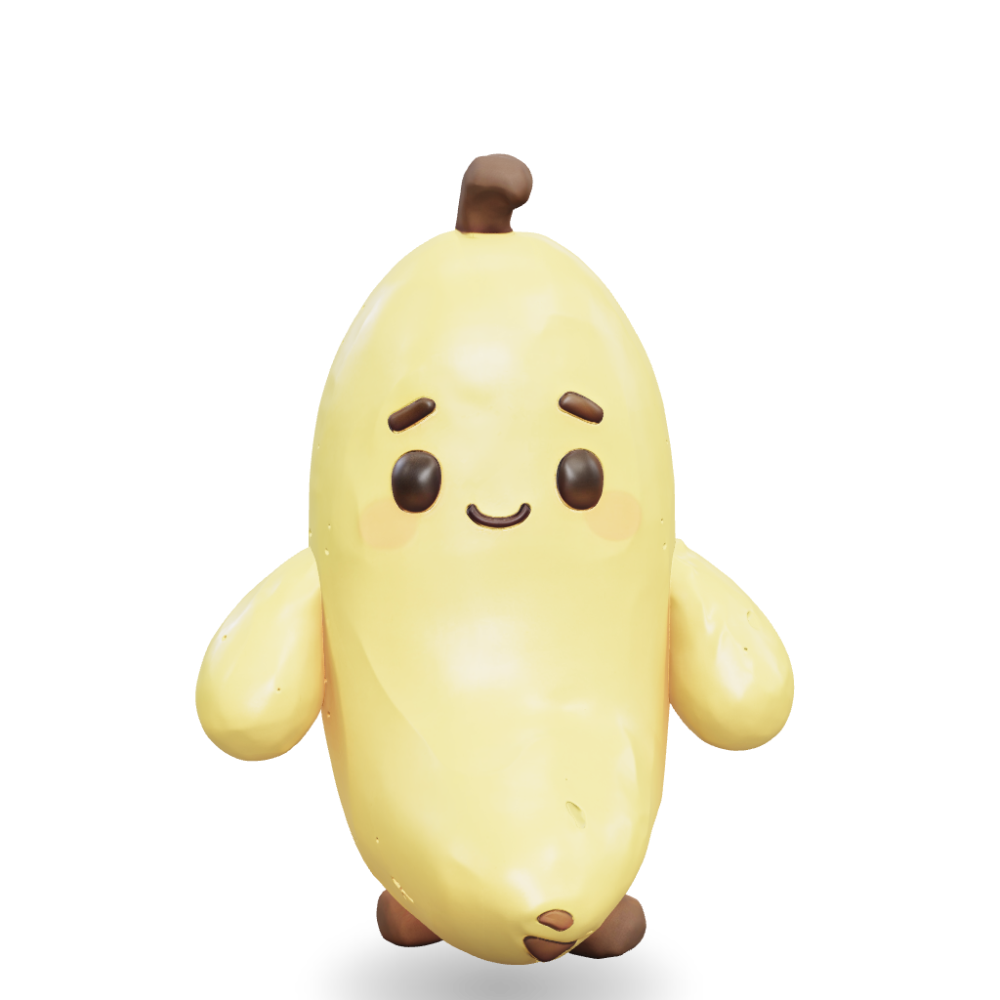

# Bananino

A 3D banana buddy that lives in the corner of your Mac. Brush the corner with your cursor
and it slides in; click it and it hands you a panel for **notes**, **fast time tracking**,
and **clipboard history**. Everything is stored as plain files on your own disk.



## Install on a Mac (no build needed)

1. Download `Bananino-*-arm64.dmg` from
   [**Releases**](https://github.com/tonitool/bananino/releases).
2. Open the DMG and drag **Bananino** into **Applications**.
3. The app is unsigned, and macOS shows its usual misleading message for that —
   **"Bananino is damaged and can't be opened."** It is not damaged; remove the
   download quarantine flag once in Terminal, then launch it normally:

   ```bash
   xattr -dr com.apple.quarantine /Applications/Bananino.app
   ```
4. Optional: add it under **System Settings → General → Login Items** so it
   starts with your Mac.

First meeting transcription downloads the Whisper model (~490 MB) from
HuggingFace on demand — nothing else to install. Meeting summaries use a local
[Ollama](https://ollama.com) model if one is running, which is optional.

Apple Silicon (arm64) only.

## Run from source

```bash
npm install
npm start
```

## Build a real app

```bash
npm run optimise-model   # first time only: generates assets/character.glb from the source model
npm run dist
```

Produces `release/mac-arm64/Bananino.app`. Drag it to `/Applications`, then add it under
**System Settings → General → Login Items** to have it there at startup.

It is unsigned, so the first launch needs a right-click → **Open** (or
`xattr -dr com.apple.quarantine /Applications/Bananino.app`).

## Waking it up

By default the buddy is hidden. It appears when your cursor rests in the **bottom-right
corner** for a moment, and tucks itself away again once you have been elsewhere for about
a second. The corner is configurable in the menu bar icon, as is **Always visible** if you
would rather it just stayed out.

> **macOS Quick Note uses the bottom-right hot corner too.** Turn it off under
> **System Settings → Desktop & Dock → Hot Corners** so only one of them fires, or move
> Bananino to a different corner.

## Shortcuts

| Shortcut | Action |
| --- | --- |
| `⌃⌥Space` | Open / close the panel |
| `⌃⌥N` | Open the panel on a fresh note |
| `⌃⌥T` | Start or stop the timer on your last task |
| `⌃⌥V` | Open clipboard history |

If another app already owns one of these, it is skipped and a line is logged — nothing
breaks. They are listed in the menu bar icon's menu too.

## The panel

One view at a time — **Time · Note · Clips · Meet** — because a single screen holding all
of them left every part too small, and overlapping whenever one grew. A running timer is
the one thing shown on every view, as a slim strip you can click to jump back to Time.

**Time** is the timer and its MOCO status. Recent tasks are one-tap chips; typing at least
two letters searches your MOCO projects. While a timer runs there is a **description**
field — MOCO records *what you did* separately from which task it books to.

**Note** is a text box. `⌘↵` saves. Notes land in today's Markdown file, stamped with the
time, and the last few show underneath.

**Clips** is your clipboard history: click a row to copy it back, `★` to pin it so it
never ages out, `×` to forget it.

The panel always opens *away* from the anchored corner — upwards from the bottom corners,
downwards from the top ones — and the window's width never changes. Both are so that the
character stays at exactly the same place on screen when the panel opens, instead of
sliding out from under your cursor mid-click.

## Interacting with the character

| Gesture | What happens |
| --- | --- |
| Move the cursor anywhere | It turns to follow you |
| Click | Opens / closes the panel |
| Double-click | Full spin |
| Drag | Carried around (in **Always visible** mode) |
| Right-click | The full menu |
| Leave it alone | It fidgets and mutters to itself |

Everywhere the character is *not* drawn, clicks pass straight through to whatever is
underneath — including the empty air inside the character's own square, so clicking beside
it never starts a phantom drag.

Two of those only apply in **Always visible** mode. Dragging is pointless while docked
(the corner is its home, so it returns there), and the idle fidget never gets a chance
because the character hides about a second after your cursor leaves.

## Dress up

The menu bar icon (and right-click on the character) has **Costume** — party hat, Santa
hat, headphones, shades, crown, beanie — and **Dance**: bounce, sway, twist, shimmy,
headbang, spin. It lives in the menu rather than the panel so the panel stays about work.
The costume is remembered between launches; dancing stops when you quit.

The model is a single static mesh with no skeleton, so there is nothing to rig clothing
onto — every costume is built from primitives (cones, tori, cylinders) at runtime. Because
the animation moves the whole rig, anything parented to it follows through hops and dances
for free.

Nothing is positioned by hard-coded numbers. The mesh is probed with raycasts at load to
build a profile of the head, and each accessory seats itself at the height where the head
is as wide as the accessory is. A hat placed at one fixed height either floats above a
dome or sinks into it — and a swapped-in model would put its hat somewhere absurd.

## MOCO time sync

Connect from the **Time** tab: your MOCO subdomain and a personal API key from
**MOCO → Profile → Integrations**. The key is encrypted with `safeStorage`, which on macOS
is the login Keychain — never written in plain text, never logged.

Typing searches your assigned projects, shown **project first, then your role** — the order
MOCO asks for, and the only way to tell apart two projects that share a role name. Each
entry is dated from when the timer *started*, so today's work books to today.

Stopping a timer **queues** the entry; it is never sent automatically. The bar shows
`3 entries queued · Push`, with **Review** to see them and **×** to discard. These become
billable records, so they are shown before they are submitted.

## Where your data goes

Everything is plain files in `~/Documents/bananino` (changeable via **Change folder…** —
point it at iCloud Drive, a Dropbox folder, or an Obsidian vault):

```
bananino/
├── notes/2026-09-01.md     one Markdown file per day, newest entry at the bottom
└── time/2026-09.csv        date,start,end,minutes,task
```

The CSV is properly quoted, so tasks containing commas or quotes survive a round trip into
Excel or Numbers.

**Clipboard history** is the exception: it lives in
`~/Library/Application Support/Bananino/clips.json`, capped at 100 entries, because it is a
cache rather than a document. It is **not encrypted**. Clips that a password manager marks
as concealed, transient, or auto-generated are never recorded, and if the pasteboard
cannot be inspected the entry is dropped rather than risked. You can pause capture
entirely from the menu (**Remember clipboard**).

## How it works

The supplied model is a single static mesh — no skeleton, no glTF animations — so every
bit of movement is procedural. Pose layers (idle breathing, float, gaze, hover, drag
momentum, reactions) each produce a small transform delta; they are summed each frame and
applied to a rig whose scale pivot sits at the character's feet, so squash and stretch
push into the floor instead of shrinking towards the middle.

```
src/
├── main/            Electron: window, hot corner, click-through, tray, shortcuts
│   └── storage/     Markdown notes, CSV time log, clip cache, date + CSV helpers
├── preload/         The contextBridge surface the renderer is allowed to use
└── renderer/
    ├── scene/       three.js renderer, camera, lighting, model loading
    ├── animation/   Pose layers, easing, the reaction library
    ├── interaction/ Pixel-accurate hit testing, pointer intent
    ├── state/       Immutable pet state
    └── ui/panel/    Timer strip, note tab, clips tab
```

### Click-through

The window is a transparent rectangle, but only the character should be clickable. The
main process samples the global cursor at 30 Hz and forwards it to the renderer, which
raycasts against the mesh. On a hit, the window stops ignoring mouse events; the moment
the cursor leaves the silhouette it becomes transparent to clicks again. The main process
independently restores click-through if the cursor leaves the window bounds, so a fast
flick cannot leave the window stuck swallowing input. With the panel open the whole window
is a target instead.

### Dismissing the panel

Clicking away closes the panel — but only once focus has actually landed *and settled*.
Claiming focus from another app is not instantaneous, and without both checks the flicker
during activation slams the panel shut the instant it opens.

## Development

```bash
npm run dev      # renderer console + window events mirrored to the terminal
npm run watch    # rebuild the renderer on change
npm test         # geometry and cursor-tracking unit tests
```

Flags that help when tuning. All of them render for a moment and write a PNG of the
composited window, transparency included:

```bash
npx electron . --open-panel=clips --pin-panel --snapshot=/tmp/panel.png:4000
npx electron . --demo=hop --snapshot=/tmp/hop.png:2000
```

| Flag | Purpose |
| --- | --- |
| `--reveal` | Bring the character out without waiting for the hot corner |
| `--open-panel[=note\|clips]` | Start with the panel open on a given tab |
| `--pin-panel` | Stop the panel dismissing itself while a screenshot is taken |
| `--demo=<reaction>` | Play one reaction on launch |
| `--tap[=1\|2]` | Inject a click or double-click on the character |
| `--click=<selector>` | Click the centre of a live element, measured from the layout |
| `--costume=<name>` / `--dance=<name>` | Set the dress-up state |
| `--probe=<expression>` | Evaluate JavaScript in the page and log the result |
| `--meeting-test=<seconds>` | Record for a period, then run the whole meeting pipeline |
| `--snapshot=<path>[:ms]` | Write a PNG of the composited window, then quit |

`--tap` is how the pointer gestures get verified without a human hand:

```bash
npx electron . --dev --tap=2 --pin-panel --snapshot=/tmp/tap.png:5000
```

Reaction names live in [reactions.js](src/renderer/animation/reactions.js): `hop`, `spin`,
`wobble`, `squish`, `stretch`.

## Swapping in your own model

Drop a `.glb` at `assets/character.glb` and run `npm run build`. It is normalised to one
unit tall and stood on the floor automatically. If it does not face the camera:

```bash
BANANINO_YAW=1.5707963 npm start
```

Once you know the value, set `DEFAULT_YAW` in
[loadCharacter.js](src/renderer/scene/loadCharacter.js), then regenerate the app icon from
the model itself with `npm run icon`.
